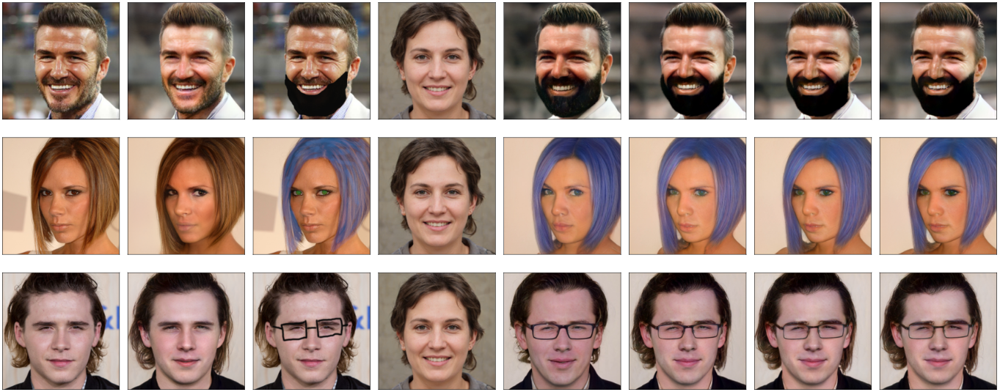

# Intro in the Generative Adversarial Networks

Report is available here: [./report.pdf](./report.pdf)



This repository implements 3 Generative Adversarial Networks (GANs) on the MNIST dataset:
 * Simple GAN ([./First_GAN.ipynb](./First_GAN.ipynb))
 * DC-GAN [1] ([./DC_GAN.ipynb](./DC_GAN.ipynb))
 * WGAN-PG [2,3] ([./W_GAN.ipynb](./W_GAN.ipynb))

Checkpoints for pretrained networks are available [here](https://drive.google.com/drive/folders/1pe1uFsKbNa1B8kYuiMptQpi2fLXi8oLe?usp=sharing), you should put them in the `./checkpoints/` directory.

Interpolation between two noise vectors is demonstrated in [./Interpolation.ipynb](./Interpolation.ipynb).

Example of fixing childish paint skills using StyleGAN2 [4] is demonstrated in [./StyleGAN2.ipynb](./StyleGAN2.ipynb).
Additionally, StyleGAN2-ADA [4] wrapper scripts are provided in the `./tools/`.

## Requirements

* Docker
* [NVIDIA Container Runtime](https://github.com/NVIDIA/nvidia-container-runtime)
* Conda (see [./conda-env.yml](./conda-env.yml))
* NVIDIA GPU, NVIDIA drivers (see [NVlabs/stylegan2-ada](https://github.com/NVlabs/stylegan2-ada))

## Tools

```bash
# --- StyleGAN2 ---
$ ./tools/stylegan2-generate.sh -h
$ ./tools/stylegan2-projector.sh -h

# --- MISC ---
# Clean large notebook
$ ./tools/jupyter-clean.sh my_notebook.ipynb
```

## References
[1] [Radford, Alec, Luke Metz, and Soumith Chintala. "Unsupervised representation learning with deep convolutional generative adversarial networks." arXiv preprint arXiv:1511.06434 (2015).](https://arxiv.org/pdf/1511.06434v1.pdf)

[2] [Arjovsky, Martin, Soumith Chintala, and Léon Bottou. "Wasserstein gan." arXiv preprint arXiv:1701.07875 (2017).](https://arxiv.org/pdf/1701.07875.pdf)

[3] [Gulrajani, Ishaan, et al. "Improved training of wasserstein gans." Advances in neural information processing systems. 2017.](https://arxiv.org/pdf/1704.00028.pdf)

[4] [Karras, Tero, et al. "Training generative adversarial networks with limited data." arXiv preprint arXiv:2006.06676 (2020).](https://arxiv.org/pdf/2006.06676.pdf)

[5] [Build Basic Generative Adversarial Networks (GANs) by deeplearning.ai](https://www.coursera.org/learn/build-basic-generative-adversarial-networks-gans)